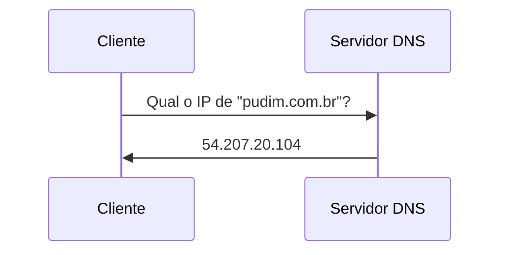
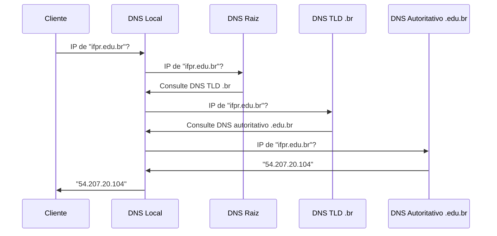
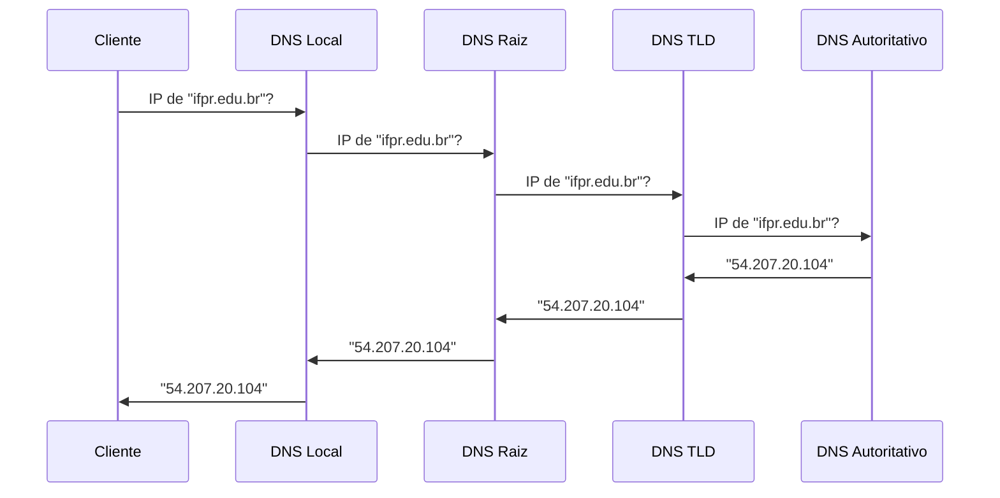
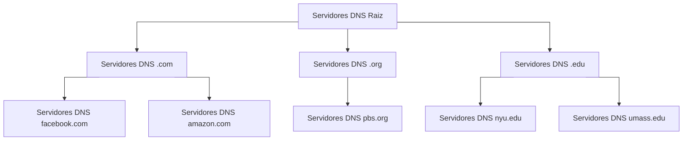

import Tabs from '@theme/Tabs';
import TabItem from '@theme/TabItem';

# DNS


O DNS (_**D**omain **N**ame **S**ystem_ - Sistema de nomes e domínios) é um sistema responsável por traduzir nomes de domínio em endereços IP, o que ocorre sempre que acessamos um *site* na internet pelo seu nome.

Seu funcionamento opera como um banco de dados distribuído, que tem como tarefa principal associar nomes de *hosts* a endereços IP.

**Atividade**
- Para refletir:
    - Como seria um mundo em que as pessoas não tivesses nomes, apenas números de CPF ou RG. Você lembraria o nome de muitas ou poucas pessoas?
    - Como seria navegar pela internet se ao invés de lembrarmos nomes de sites tivéssemos que saber seus endereços IP?

**Atividade**
- A que site corresponde o endereço IP apresentado abaixo?
    - 177.11.21.36

## Funcionamento

Sabemos que a comunicação entre dispositivos é realizada utilizando os endereços IP. Porém, o que ocorre quando não conhecemos o endereço IP do website?

Vamos acessar um website, p.ex. [www.example.com](http://www.example.com) em nosso navegador. Inicialmente, o navegador verifica se já possui o endereço IP em seu *cache*. Caso não, realiza uma solicitação ao sistema operaciona, que por sua vez, também verifica em seu *cache*. Caso não possua, é realizada uma requisição a um servidor DNS.    

Caso o endereço IP do site a ser acessado ainda não seja conhecido, é utilizado o protocolo DNS, que consiste em acessar um servidor de nomes e domínios (servidor DNS) **perguntando** qual é o endereço IP do local que desejamos acessar. A resposta do servidor contém o nome e o endereço IP do site. Após receber a resposta, o site é acessado utilizando seu endereço IP.

Observe que inicialmente deve ser conhecido o endereço IP de um servidor DNS. Este é o servidor para que será perguntado qual é o endereço IP do site em que se deseja acessar. Este endereço pode vir configurado no sistema ou então fornecido de maneira dinâmica, pelo DHCP (*Dynamic Host Configuration Protocol*), junto com o endereço IP a ser utilizado pela máquina. Outra alternativa é definí-lo manualmente, colocando um endereço IP de um servidor DNS já conhecido.   



Consultas iterativas (mais comum)



Consultas recursivas


:::info Informação

<Tabs>
<TabItem value="linux" label="Linux" default>

Comumente em sistemas Linux, a configuração do DNS pode ser encontrada no arquivo `/etc/resolv.conf`, com a entrada `nameserver`.

</TabItem>
<TabItem value="windows" label="Windows">

Em sistemas Windows, estas configurações normalmente podem ser realizadas nas configurações de rede, observando as propriedades da conexão.

</TabItem>
</Tabs>

:::


**Atividade**
- Obtenha o endereço IP do servidor DNS que está sendo utilizado.


## O protocolo

O DNS é um sistema que permite que computadores na internet identifiquem e se comuniquem uns com os outros usando nomes de domínio, em vez de endereços IP numéricos. Ele realiza a correspondência entre um nome de domínio, como "google.com", e um endereço IP numérico, como "216.58.194.174", que é usado para identificar o servidor na internet.

O processo de resolução de nomes de domínio começa quando um cliente envia uma solicitação para um servidor DNS. A solicitação contém o nome de domínio do site que o cliente está tentando acessar. O servidor DNS então verifica seu banco de dados para encontrar o endereço IP associado a esse nome de domínio. Se o servidor DNS não tiver o endereço IP em seu banco de dados, ele envia uma solicitação para outros servidores DNS para encontrar a informação.

A resolução de nomes de domínio é realizada usando um protocolo de rede chamado DNS. O protocolo DNS é baseado em uma arquitetura cliente/servidor e usa mensagens de protocolo para transferir informações entre os clientes e os servidores DNS. As mensagens do protocolo DNS contêm informações como o nome de domínio que está sendo resolvido, o tipo de registro DNS que está sendo solicitado (por exemplo, um registro de endereço IP), e informações de controle para garantir a integridade e a confiabilidade da comunicação.

Existem dois tipos principais de servidores DNS: servidores de autoridade e servidores de *cache*. Os servidores de autoridade são responsáveis por manter informações sobre os nomes de domínio e seus endereços IP associados. Os servidores de *cache* mantêm uma das informações de outros servidores DNS, com o intuito de diminuir o tempo de resposta das consultas DNS.

## Tipos de registros

Existem vários tipos de registros DNS, cada um com uma finalidade diferente. Alguns dos tipos mais comuns de registros são:

- Registro de endereço (`A`): É utilizado para mapear um nome de domínio para um endereço IP IPv4. Por exemplo, o registro A para o nome de domínio *"[google.com](http://google.com)"* pode apontar para o endereço IP "[142.250.218.68](http://142.250.218.68)".

- Registro de endereço IPv6 (`AAAA`): É utilizado para mapear um nome de domínio para um endereço IP IPv6. É semelhante ao registro A, porém para endereços IPv6.

- Registro de *alias* (`CNAME`): Este registro é usado para criar um alias para um nome de domínio. Por exemplo, um registro CNAME pode ser usado para apontar *"[www.google.com](http://www.google.com)"* para *"[google.com](http://google.com)"*.

- Registro de servidor de nomes (`NS`): Este registro é usado para identificar os servidores de nomes responsáveis por um determinado nome de domínio. Cada domínio deve ter pelo menos um registro NS.

- Registro de correio (`MX`): Este registro é usado para identificar o servidor de correio responsável por um determinado nome de domínio. Isso é usado para enviar e-mails para os domínios.

- Registro de serviço (`SRV`): Este registro é usado para identificar um serviço específico que está associado a um nome de domínio. Por exemplo, um registro SRV pode ser usado para identificar um servidor de chat associado a um nome de domínio.

- Registro de texto (`TXT`): Este registro é usado para armazenar informações arbitrárias em um nome de domínio. Isso pode ser usado para fornecer informações adicionais sobre o domínio, como informações de segurança ou políticas de privacidade.

Cada registro DNS é identificado por um tipo de recurso (RR) que é definido pelo código de tipo de recurso (TRR). O código TRR é usado para identificar o tipo de registro DNS associado a um nome de domínio específico. Os registros DNS são armazenados em servidores DNS autorizados para o domínio. Quando um cliente faz uma solicitação DNS para um nome de domínio, o servidor DNS autorizado envia uma resposta contendo os registros DNS associados ao nome de domínio.

## Ferramentas

### nslookup
Uma ferramenta que resolve registros DNS é o `nslookup`

:::info Sintaxe
```sh
nslookop <-type=tipo> <SERVER>
```
Parâmetros:
- -type: corresponde ao tipo de registro. Opcional.
- SERVER : servidor DNS a ser consultado. Caos seja omitido, usa o DNS configurado na máquina
:::

**Exemplos**  

- Realize as consultas a seguir utilizando `nslookup` e observe os resultados obtidos.
    - `nslookup google.com`
    - `nslookup google.com 8.8.8.8`
    - `nslookup -type=a google.com 8.8.8.8`
    - `nslookup -type=aaaa google.com 8.8.8.8`
    - `nslookup -type=mx google.com`
    - `nslookup -type=a pudim.com.br`
    - `nslookup -type=aaaa pudim.com.br`
    - `nslookup -type=TXT facebook.com`


<!-- <iframe class="slideshow" src="./slideshow.html" frameborder=0></iframe> -->


## Servidores DNS

O DNS utiliza diversos servidores, organizados de forma hierárquica e distribuída no mundo inteiro. Há três tipos de servidores:
- Raiz
- de Domínio de Alto Nível (TLD), e;
- Autoritativos.

Estes servidores estão organizados hierarquicamente.



(Imagem adaptada de KUROSE,2021).

O vídeo abaixo (em inglês) apresenta um resumo do funcionamento dos servidores DNS.
<iframe width="560" height="315" src="https://www.youtube.com/embed/27r4Bzuj5NQ" title="YouTube video player" frameborder="0" allow="accelerometer; autoplay; clipboard-write; encrypted-media; gyroscope; picture-in-picture; web-share" allowfullscreen></iframe>

## Registro de domínios

No Brasil, a entidade responsável pelo registro de domínios é o [Registro.br](https://registro.br). Nele, é possível verificar os domínios estão disponíveis, e também, registrar domínios.

**Atividade**
- Entre no Registro.br e procure um por um domínio de sua escolha.

**Atividade**

- O quê ocorre se um máquina que estiver conectada à internet não tiver um servidor DNS configurado?
- Há diferenças entre utilizar diferentes servidores DNS? O quê poderia ocorrer com a navegação se o servidor DNS configurado para uso estiver lento?

## Referências


[KUROSE, Jim; ROSS, Keith W. Redes de computadores e a internet: uma abordagem top-down. 6.ed. São Paulo: Pearson, 2013. ISBN 9788581436777.](https://plataforma.bvirtual.com.br/Leitor/Publicacao/3843/pdf/0) (Link biblioteca online)  

[NEMETH, Evi; SNIDER, Garth; HEIN, Trent R. Manual Completo de Linux: guia do administrador. 2.ed. São Paulo: Prentice Hall, 2007. 704 p. ISBN 978-85-7605-112-1](https://plataforma.bvirtual.com.br/Leitor/Publicacao/787/epub/0) (Link biblioteca online)  

[TANENBAUM, Andrew S; WETHERAL, David. Redes de Computadores. 5.ed. São Paulo: Pearson, 2011. ISBN 9788576059240.](https://plataforma.bvirtual.com.br/Leitor/Publicacao/2610/pdf/0)(Link biblioteca online) 