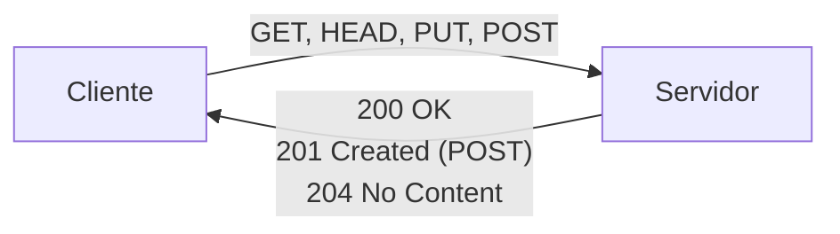
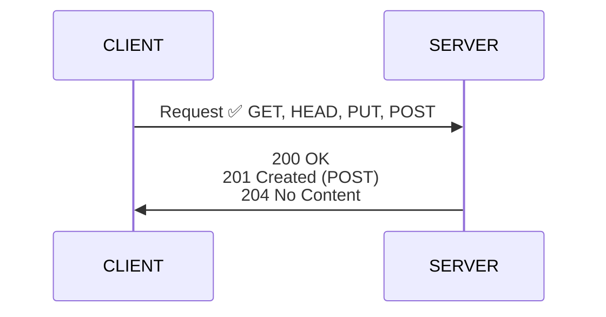
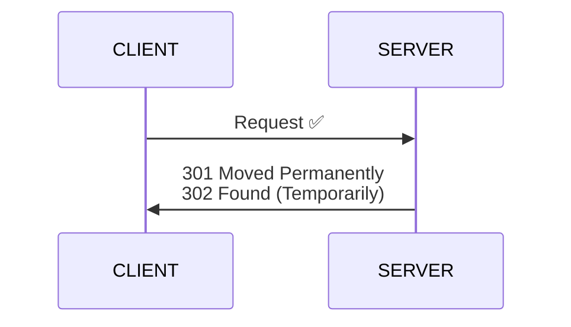
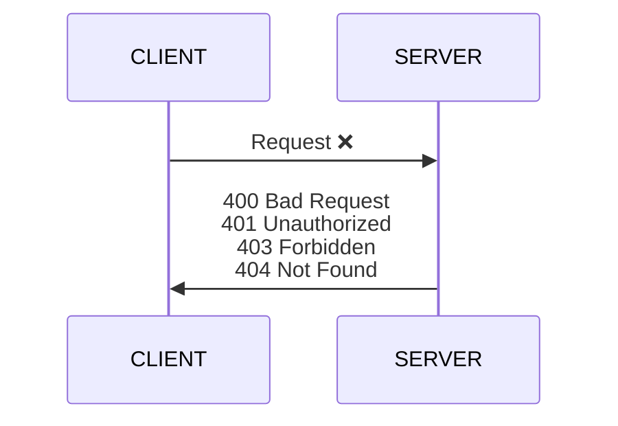
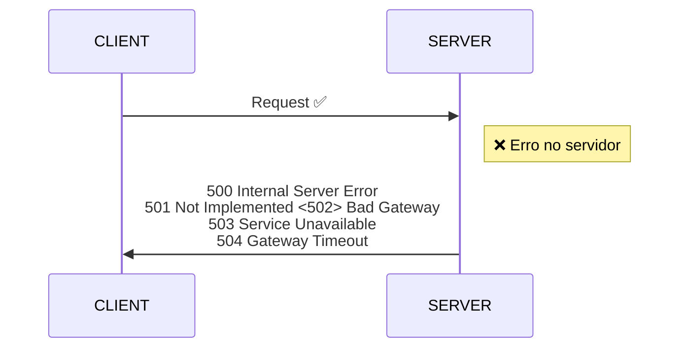

# HTTP


O Protocolo HTTP (_**H**iper**T**ext **T**ransfer **P**rotocol_) é um protocolo de comunicação utilizado para transferência de dados na World Wide Web (WWW). Ele é responsável por permitir que as aplicações web possam se comunicar com os servidores web de forma eficiente e padronizada.

Em termos simples, o HTTP permite que um cliente (como um navegador web) solicite informações a um servidor web e receba uma resposta. Essa comunicação é realizada através da troca de mensagens HTTP entre o cliente e o servidor.

O HTTP é um protocolo de camada de aplicação que utiliza a arquitetura cliente-servidor, tendo a porta 80 como padrão. Ele é baseado em um modelo de requisição-resposta, onde o cliente envia uma requisição ao servidor, e o servidor responde com uma mensagem de resposta.

A mensagem HTTP é composta por um cabeçalho e um corpo. O cabeçalho contém informações sobre a mensagem, como o tipo de requisição ou resposta, o tamanho do conteúdo, os cookies e outras informações. O corpo contém os dados da mensagem, como o conteúdo HTML, imagens ou outros arquivos.

O HTTP é um protocolo sem estado, ou seja, cada requisição é independente das outras. Isso significa que o servidor não mantém informações sobre a sessão ou o estado do cliente entre requisições. Para manter o estado entre requisições, é necessário utilizar mecanismos como cookies ou sessões.

Atualmente, o HTTP é utilizado em praticamente todas as aplicações web e é um dos protocolos mais importantes da internet. Ele evoluiu ao longo dos anos, passando por diversas versões.

A porta padrão utilizada pelo HTTP é a `80`.

## Características

- O HTTP é um protocolo sem estado, o que significa que cada requisição é independente das outras. O servidor não mantém informações sobre o estado do cliente entre as requisições. Isso torna o HTTP simples e eficiente, mas pode criar problemas quando é necessário manter informações de sessão.

- Orientado a conexão: O HTTP é um protocolo orientado a conexão, o que significa que uma conexão é estabelecida entre o cliente e o servidor antes de qualquer troca de dados. Essa conexão é mantida aberta até que a transação seja concluída ou uma das partes a encerre. Esse modelo permite que várias requisições sejam enviadas pela mesma conexão, reduzindo a latência e aumentando a eficiência.

- Baseado em texto: O HTTP é um protocolo baseado em texto, o que significa que as mensagens HTTP são legíveis por humanos. Isso torna o desenvolvimento e a depuração de aplicações web mais fácil, pois os desenvolvedores podem visualizar o conteúdo das mensagens em um editor de texto. Além disso, o HTTP utiliza um formato padronizado para as mensagens, o que facilita a criação de ferramentas de análise e monitoramento.

- Independente de plataforma: O HTTP é um protocolo independente de plataforma, o que significa que ele pode ser executado em qualquer sistema operacional ou arquitetura de hardware. Isso torna o HTTP uma escolha popular para desenvolvedores que desejam criar aplicações web que funcionam em diferentes plataformas.

- Extensível: O HTTP é um protocolo extensível, o que significa que é possível estender suas funcionalidades através de cabeçalhos HTTP personalizados. Isso permite que as aplicações web criem suas próprias funcionalidades específicas, sem comprometer a compatibilidade com outros servidores HTTP.

## Funcionamento básico

O HTTP é um protocolo cliente-servidor baseado em requisição-resposta. Isso significa que um cliente (como um navegador *web*) envia uma requisição a um servidor *web* e o servidor envia uma resposta de volta para o cliente.

As requisições HTTP são compostas por um método, um URI (_**U**niform **R**esource **I**dentifier_) e um cabeçalho, seguido pelo corpo da mensagem, que é opcional. Métodos comuns são `GET`, `POST`, `PUT`, `DELETE` e `HEAD`.

- `GET`: Solicita uma representação do recurso identificado pelo URI. É usado para recuperar informações do servidor.

- `POST`: Envia dados do cliente para o servidor para processamento. É usado para enviar informações do formulário ou carregar arquivos.

- `PUT`: Envia dados do cliente para substituir um recurso existente no servidor.

- `DELETE`: Exclui um recurso identificado pelo URI no servidor.

- `HEAD`: É semelhante ao GET, porém retorna apenas o cabeçalho da resposta, sem o corpo da mensagem.

**Exemplo**  
- Requisição GET

```http
GET /index.html HTTP/1.1
Host: www.exemplo.com
User-Agent: Mozilla/5.0 (Windows NT 10.0; Win64; x64; rv:95.0) Gecko/20100101 Firefox/95.0
Accept: text/html,application/xhtml+xml,application/xml;q=0.9,image/webp,*/*;q=0.8
Accept-Language: pt-BR,pt;q=0.8,en-US;q=0.5,en;q=0.3
Connection: keep-alive
```

O URI identifica o recurso no servidor que o cliente deseja acessar. Ele geralmente começa com o protocolo utilizado (como `http://` ou `https://`), seguido pelo nome do servidor e o caminho do recurso.

O cabeçalho HTTP contém informações adicionais sobre a requisição, como os cookies do cliente, as informações de autenticação e o tipo de conteúdo que o cliente espera receber. O corpo da mensagem é opcional e é usado apenas em algumas requisições, como `POST` e `PUT`.

**Exemplo** 
- Rsposta HTTP:

```http
GET /index.html HTTP/1.1
Host: www.exemplo.com
User-Agent: Mozilla/5.0 (Windows NT 10.0; Win64; x64; rv:95.0) Gecko/20100101 Firefox/95.0
Accept: text/html,application/xhtml+xml,application/xml;q=0.9,image/webp,*/*;q=0.8
Accept-Language: pt-BR,pt;q=0.8,en-US;q=0.5,en;q=0.3
Connection: keep-alive
``` 

Quando o servidor recebe uma requisição HTTP, ele processa a requisição e envia uma resposta de volta para o cliente. A resposta HTTP também é composta por um cabeçalho e um corpo.

### Códigos HTTP

O cabeçalho HTTP da resposta contém informações sobre o resultado da requisição, como o código de *status* da requisição HTTP. Cada código HTTP é cada por um valor entre 100 e 600, e os códigos estão organizados em 5 categorias:

|Categoria        |Faixa de valores|
|-----------------|---------|
|Informacional    |100 a 199|
|Sucesso          |200 a 299|
|Redirecionamento |300 a 399|
|Erro no cliente  |400 a 499|
|Erro servidor    |500 a 599|


Alguns códigos comuns incluem:



**Exemplos**  


- `200 OK`: A requisição foi bem-sucedida e o servidor retornou os dados solicitados.
- `201 Create`: .
- `204 No Content`: .



- `301 Moved Permanently`: .
- `302 Found (Temporarily)`: .



- `400 Bad Request`: .
- `401 Unauthorized`: .
- `403 Forbidden`: .
- `404 Not Found`: O servidor não encontrou o recurso solicitado pelo cliente.



- `500 Internal Server Error`: O servidor encontrou um erro ao processar a requisição.
- `501 Not Implemented`: .
- `502 Bad Gateway`: .
- `502 Service Unavailable`: .
- `504 Gateway Timeout`: .


O corpo da mensagem contém os dados da resposta, como o conteúdo HTML, imagens ou outros arquivos.

Em resumo, o funcionamento básico do HTTP é baseado em requisição-resposta, com o cliente enviando uma requisição HTTP para o servidor e o servidor enviando uma resposta HTTP de volta para o cliente. O HTTP é um protocolo simples e eficiente que permite que as aplicações web se comuniquem de forma padronizada e confiável.

## URL

Os navegadores *web* utilizam as URL (*Uniform Resource Locator*). Uma URL é um endereço que especifica a localização de um recurso na **web**. As URLs são usadas para acessar recursos, como páginas da **web**, imagens, arquivos de áudio ou vídeo, etc. na internet. Uma URL HTTP é composta por vários componentes que especificam diferentes partes do endereço.

**Exemplo**
- URL:

```
http://www.exemplo.com/pagina.html?parametro1=valor1&parametro2=valor2
```

- Protocolo: O protocolo usado para acessar o recurso, neste caso, o protocolo HTTP.

- Domínio: O nome de domínio do servidor web que hospeda o recurso, neste exemplo, "www.exemplo.com". Pode ser substituído também pelo endereço IP do servidor.

- Caminho: O caminho para o recurso no servidor web, neste exemplo, "/pagina.html".

- Parâmetros de consulta: Os parâmetros adicionais que são passados para o servidor web com a solicitação, separados por "&". Neste exemplo, os parâmetros são "parametro1=valor1" e "parametro2=valor2".


## Conexões

O HTTP é um protocolo baseado em conexão. Isso significa que ele usa conexões TCP.

<details>
  <summary>TCP</summary>

O TCP (_**T**ransmission **C**ontrol **P**rotocol_) é um protocolo de camada de transporte, utilizado para estabelecer uma comunicação entre o cliente e o servidor.

Uma conexão TCP é uma conexão orientada a fluxo que garante a entrega confiável de dados em ambas as direções. Isso significa que o cliente e o servidor podem enviar e receber dados de forma confiável, sem perda de pacotes ou corrupção de dados.

</details>  

O HTTP pode usar duas abordagens diferentes para estabelecer uma conexão:

- Conexão persistente: nessa abordagem, a conexão TCP é mantida aberta após a primeira requisição e resposta entre o cliente e o servidor. Isso permite que o cliente envie várias requisições usando a mesma conexão, o que pode melhorar o desempenho, reduzindo o tempo necessário para estabelecer uma nova conexão TCP.  


<details>
  <summary>Conexão persistente</summary>

  Quando o HTTP usa conexão persistente, a conexão TCP entre o cliente e o servidor é mantida aberta após a primeira requisição e resposta. Isso significa que, em vez de estabelecer uma nova conexão TCP para cada requisição, o cliente pode enviar várias requisições usando a mesma conexão.

Existem algumas vantagens na utilização de conexões persistentes no HTTP, tais como:

Redução do tempo necessário para estabelecer uma nova conexão TCP, o que pode melhorar o desempenho em algumas situações.

Redução do número de pacotes enviados pela rede, o que pode melhorar o desempenho em redes com latência alta.

Permite a utilização do pipeline de requisições, em que o cliente pode enviar várias requisições sem esperar pela resposta do servidor para cada uma delas. Isso pode melhorar significativamente o desempenho em algumas situações.

Por outro lado, o uso de conexões persistentes pode levar a problemas de escalabilidade em servidores com grande número de clientes, uma vez que a conexão TCP entre o cliente e o servidor é mantida aberta por um período prolongado de tempo.

</details>  

- Conexão não persistente: nessa abordagem, a conexão TCP é fechada após cada requisição e resposta entre o cliente e o servidor. Isso significa que o cliente precisa estabelecer uma nova conexão TCP para cada requisição. Essa abordagem é menos eficiente em termos de desempenho, mas é mais adequada para conexões de curta duração.  

<details>
  <summary>Conexão não persistente</summary>
  Quando o HTTP usa conexão não persistente, a conexão TCP entre o cliente e o servidor é fechada após cada requisição e resposta. Isso significa que o cliente precisa estabelecer uma nova conexão TCP para cada requisição que deseja enviar.

Existem algumas desvantagens na utilização de conexões não persistentes no HTTP, tais como:

A necessidade de estabelecer uma nova conexão TCP para cada requisição pode aumentar o tempo necessário para enviar uma requisição e receber a resposta correspondente, uma vez que o processo de estabelecimento de conexão TCP envolve a troca de vários pacotes entre o cliente e o servidor.

O número de conexões TCP estabelecidas pode aumentar consideravelmente em situações em que o cliente precisa enviar várias requisições em um curto período de tempo, o que pode levar a problemas de escalabilidade no servidor.

O pipeline de requisições não pode ser utilizado em conexões não persistentes, uma vez que o cliente precisa esperar pela resposta do servidor antes de enviar a próxima requisição.

Por outro lado, a utilização de conexões não persistentes pode ser mais adequada em situações em que o cliente precisa enviar apenas uma ou duas requisições em um curto período de tempo, uma vez que o custo de estabelecer uma nova conexão TCP é relativamente baixo.
</details>

Além disso, o HTTP também oferece suporte a conexões seguras usando SSL/TLS (Secure Sockets Layer/Transport Layer Security). Isso permite que o cliente e o servidor criptografem a comunicação, garantindo que os dados sejam transmitidos com segurança e privacidade.

Em resumo, as conexões HTTP são estabelecidas usando conexões TCP e podem ser persistentes ou não persistentes, dependendo da abordagem escolhida pelo cliente e pelo servidor. Além disso, o HTTP também oferece suporte a conexões seguras usando SSL/TLS.

## Mensagens

## *Cookies*

Os cookies são pequenos arquivos de texto que são armazenados no computador do usuário pelo navegador *web*, em resposta a uma requisição HTTP enviada pelo servidor. Eles são usados para manter informações sobre a interação do usuário com um determinado site, como preferências de *login*, histórico de compras, entre outras.

Os cookies são enviados pelo servidor ao cliente por meio dos cabeçalhos HTTP, e são armazenados no navegador do cliente. Quando o cliente faz uma nova requisição HTTP para o mesmo site, o navegador inclui os *cookies* correspondentes nos cabeçalhos da requisição, permitindo que o servidor identifique o cliente e mantenha informações sobre sua interação anterior.

Os cookies são compostos de um nome, um valor e um conjunto de atributos opcionais, como data de expiração, domínio, caminho, entre outros. O nome e o valor são especificados pelo servidor e armazenados no navegador do cliente. Os atributos são usados para controlar quando o cookie deve ser enviado de volta ao servidor.

Existem dois tipos principais de cookies:

 - *Cookies* de sessão (*Session cookies*): são criados pelo servidor quando o usuário se conecta a um *site* e são excluídos quando o usuário fecha o navegador. Eles são usados para manter informações sobre a sessão do usuário, como suas preferências de *login*, e não são armazenados permanentemente no computador do usuário.

- *Cookies* persistentes (*Persistent cookies*): são criados pelo servidor com uma data de expiração definida e são armazenados no computador do usuário até a data de expiração ou até que o usuário os exclua manualmente. Eles são usados para manter informações sobre a interação do usuário com um site ao longo do tempo, como histórico de compras, preferências de idioma, entre outros.

Os *cookies* são amplamente utilizados na *web* para personalizar a experiência do usuário e para manter informações sobre sua interação com um determinado site. No entanto, eles também podem ser usados para fins maliciosos, como rastreamento de atividades do usuário e coleta de informações pessoais. Por essa razão, muitos navegadores oferecem opções para bloquear ou limitar o uso de *cookies* por sites específicos.

<!-- ## *Caches* -->

**Atividade**

- Coloque o servidor netcat para ouvir na porta 8080, e quando conectarem, envie o conteúdo abaixo, correspondente ao arquivo `resposta.txt`:


```http
HTTP/1.0 200 OK
Date: Mon, 14 Mar 2023 21:30:00 GMT
Server: AulaRedes/1.0
Content-Type: text/HTML

<html><h1>Aula De Redes de Computadores - IFPR Cascavel</h1></html>

```

Em seguida execute:  
```bash
nc -l 8080 < resposta.txt
```

Em seguida, abra utilizando um navegador:
```
http://localhost:8080
```

## Referências

- [KUROSE, Jim; ROSS, Keith W. Redes de computadores e a internet: uma abordagem top-down. 8.ed. São Paulo: Pearson, 2021. ISBN 9788582605592.](https://plataforma.bvirtual.com.br/Acervo/Publicacao/198909)