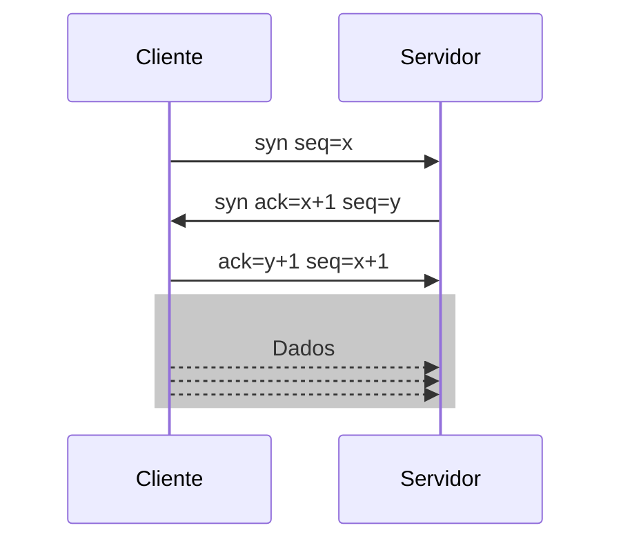
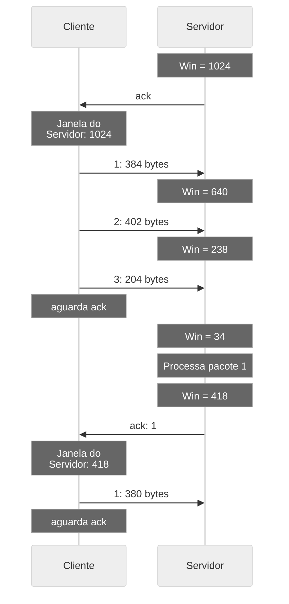
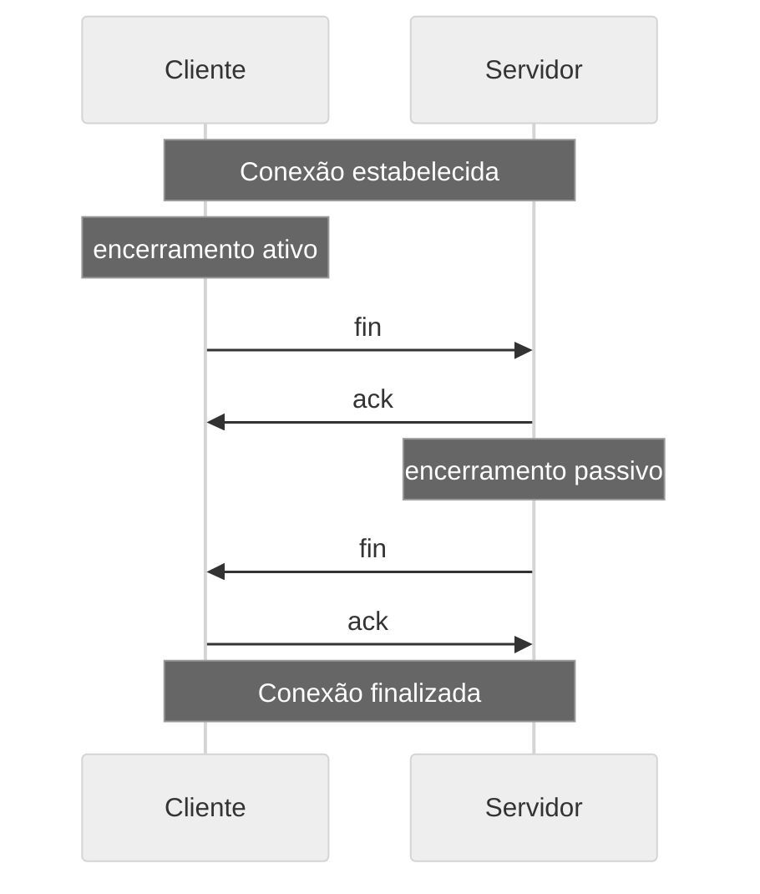

# TCP

O TCP (*Transmission Control Protocol*) é um protocolo **orientado a conexão**. Seu funcionamento opera em três fases:
- Estabelecimento da conexão
- Transferência dos dados
- Término da conexão.

O TCP é um protocolo *Full-duplex*, ou seja, dados podem ser enviados e recebidos na mesma conexão.

## Estrutura do segmento TCP

O cabeçalho do pacote TCP possui o seguinte formato:

Figura: Cabeçalho do pacote TCP.
  
Fonte: [Wikimedia Commons](https://commons.wikimedia.org/wiki/File:TCP_Protocol_Diagram.png)  

**Campos**  
- Porta de origem
- Porta de destino
- Número de sequência (seq)
- Número de reconhecimento (ack)
- Tamanho do cabeçalho
- Reservado
- Flags
- Tamanho da janela
- Checksum
- Ponteiro do dado urgente
- Opções
- Dados

**_Flags_**  
As *flags* do TCP são:
- URG: *urgent*. Indica que o processo que solicitou o envio do marcou dados como urgente
- ACK: *acknowledgement*, ou reconhecimento
- PSH: *push*. Destinatário deve repassar dados para camada superior
- RST: *reset*. Utilizado para restabelecer e encerrar a conexão
- SYN: Utilizado para estabelecer e encerrar a conexão
- FIN: *finish*. Utilizado para encerrar a conexão

Na prática, as *flags* URG, PSH e o campo *Urgent pointer* não são utilizados (KUROSE 2013).

## Conexão
o TCP é um procotolo **orientado a conexão**, ou seja, possui estados de início, transferência e finalização. As informações sobre os estados residem apenas nos sistemas finais.

Dado que o protocolo TCP não é executado em elementos intermediários (*hubs*, *switches*, roteadores), as variáveis que controlam o estado da conexão estão centralizadas nos sistemas finais.

### Início da conexão

O aperto de mãos em três vias, ou *three-way handshake* é a maneira em que o protocolo TCP inicia uma conexão. No diagrama _x_ corresponde ao número de sequência do cliente e _y_ ao número de sequência do servidor.



<!--   
Fonte: [Wikimedia Commons](https://commons.wikimedia.org/wiki/File:Tcp-handshake.png)  -->

A conexão é iniciada com o cliente enviando um pacote com a *flag* SYN ativa. Espera-se que o servidor aceite a conexão e retorne um pacote com as *flags* SYN e ACK setadas.

### Transferência dos dados

Cada segmento enviado pelo cliente ao servidor possui um tamanho e um número de sequência. O servidor confirma o recebimento (ACK) de cada segmento, e avisa o tamanho de sua janela.



<!--   
Fonte: [Wikimedia Commons](https://commons.wikimedia.org/wiki/File:TCP_windowing.png)  -->

Uma das características do TCP consiste em poder enviar e receber diversos segmentos simultaneamente. Porém, isto pode ser aplicado a apenas a parte da sequência de segmentos, e a este grupo de segmentos denomina-se janela. à medida que os segmentos vão sendo recebidos e confirmados pelo destinatário, a janela deixa de incluir os primeiros segmentos confirmados e passa a incluir os segmentos seguintes. Esta técnica é chamada de *janela deslizante*.

O vídeo do link possui uma animação que demonstra a janela deslizante. Perceba que à medida que os segmentos são confirmados, o grupo de segmentos abordados (janela) move-se para a direita e *desliza* para abranger os próximos segmentos.

[TCP sliding window animation](https://www.youtube.com/watch?v=zY3Sxvj8kZA)  

Adicionalmente, pode-se utilizar o simulador disponível no link abaixo.

[KESSLER 2012](https://www.ccs-labs.org/teaching/rn/animations/gbn_sr/)

### Término da conexão



<!--   
Fonte: [Wikimedia Commons](https://commons.wikimedia.org/wiki/File:TCP_CLOSE.svg)  -->

<!--   
Fonte: [Wikimedia Commons](https://pt.wikipedia.org/wiki/Ficheiro:TCP_termination.png)  -->

**Exemplo**  
Captura de pacotes de uma conexão TCP.
- Server:
    ```shell
     nc -l 10100
    ```
    - Saída:
- Client:
    ```shell
     echo 'Aula de redes de computadores' > msg.txt
     nc -N localhost 10100 < msg.txt
    ```
    - Saída:
- Sniffer:  
    Observa a interface de *loopback* na porta 10100
    ```shell
    tshark -i lo host localhost and port 10100
    ```
    - Saída:
```
1[...] TCP 74 43682→ 10100 [SYN] Seq=0 Win=65495 Len=0 MSS=65495 SACK_PERM=1 TSval=3650491938 TSecr=0 WS=128
2[...] TCP 74 10100→ 43682 [SYN, ACK] Seq=0 Ack=1 Win=65483 Len=0 MSS=65495 SACK_PERM=1 TSval=3650491938 TSecr=3650491938 WS=128    
3[...] TCP 66 43682→ 10100 [ACK] Seq=1 Ack=1 Win=65536 Len=0 TSval=3650491938TSecr=3650491938    
4[...] TCP 96 43682→ 10100 [PSH, ACK] Seq=1 Ack=1 Win=65536 Len=30 TSval=3650491938 TSecr=3650491938
5[...] TCP 66 10100→ 43682 [ACK] Seq=1 Ack=31 Win=65536 Len=0 TSval=3650491938 TSecr=3650491938
6[...] TCP 66 43682→ 10100 [FIN, ACK] Seq=31 Ack=1 Win=65536 Len=0 TSval=3650491938 TSecr=3650491938
7[...] TCP 66 10100→ 43682 [FIN, ACK] Seq=1 Ack=32 Win=65536 Len=0 TSval=3650491938 TSecr=3650491938
8[...] TCP 66 43682→ 10100 [ACK] Seq=32 Ack=2 Win=65536 Len=0 TSval=3650491938 TSecr=3650491938
```
    - Observe:
        - `[...] ` indica texto removido, para facilitar a visualização
        - Portas:
            - 10100: servidor
            - 43682: cliente
        - Linhas 1a 3 início da conexão
            - 1 cliente envia segmento com a *flag* SYN ao servidor
            - 2 servidor envia segmento com as *flags* SYN e ACK ao cliente
            - 3 cliente envia segmento com a *flag* ACK ao servidor
        - Linhas 4 e 5: envio dos dados
            - 4:
                - Cliente envia dados ao servidor
                - 30 bytes de dados. Qual o tamanho da mensagem enviada?
            - 5:
                - Servidor envia ao cliente a confirmação do recebimento da mensagem
        - Linhas 6 a 8: término da conexão
            - 6: cliente envia FIN e ACK
            - 7: servidor envia FIN e ACK
            - 8: cliente envia ACK
    
**Observação**  
Na execução do exemplo, utilize diferentes números de portas caso esteja utilizando um ambiente de execução compartilhado.

**Atividade**  
- Objetivo:
    - Observar os pacotes de início de uma conexão TCP.
- Utilize o netcat (`nc`) e inicie e finalize uma conexão, sem enviar nenhum dado. Capture as informações dessa conexão com o `tshark`. Encerre a captura de pacotes antes de finalizar a conexão, para obter apenas os pacotes de início da conexão.

**Atividade**  
- Objetivo:
    - Capturar pacotes TCP e observar suas características.
- Navegue na internet, capturando pacotes. No `wireshark`, observe os pacotes TCP, analizando:
    - Tamanho do pacote
    - Tamanho do cabeçalho
    - Tamanho dos dados
    - *Flags*
    - Número de sequência do pacote.
- **Observação**: caso não esteja disponível um navegador *web* gráfico, podem ser utilizados navegadores em modo texto, como o `links` ou utilizando ferramentas como `wget` e `curl`.
    - Exemplo
    ```bash
    links http://www.pudim.com.br
    wget http://www.pudim.com.br
    curl www.pudim.com.br
    ```

**Atividade**  
- Objetivo:
    - Observar os pacotes de início e fim de uma conexão TCP.
- Utilizando o `tshark`, capture pacotes de uma conexão com o netcat, em que dados não são trocados, existe apenas início e fim da conexão.

**Atividade**  
- Objetivo:
    - Capturar pacotes TCP gerados e observar suas características.
- Utilizando o `tshark`, capture pacotes de uma conexão netcat, em que uma única frase é enviada do cliente para o servidor.

**Atividade**  
- Objetivo:
    - Capturar pacotes TCP gerados e observar suas características.
- Utilizando o `tshark`, capture pacotes de uma conexão netcat, em que uma única frase é enviada do cliente para o servidor e uma frase é enviada do servidor para o cliente. Analise os pacotes.

**Atividade**  

- Objetivo:
    - Observar a quebra de mensagens grandes em diversos segmentos TCP.
- Faça várias conexões com o netcat, enviando arquivos cada vez maiores. Compare a quantidade de pacotes TCP trafegados em cada conexão do netcat, e verifique a partir de qual tamanho de arquivo foi enviado mais de um pacote TCP para os dados.

Uma forma de gerar arquivos de tamanho arbitrário é utilizando o `dd`:
```bash
dd if=/dev/zero of=nomeArquivo.bin count=1 bs=512
```
sintaxe:
- `of`: *output file*, com nome do arquivo a ser gerado.
- `bs`: *block size*, com o tamanho do arquivo, em bytes.

**Exemplo**  
Execute os comandos abaixo, em diferentes terminais  
- Terminal 1: servidor netcat
> nc -l 10100
Term
- Terminal 2: tshark
> tshark -i lo port 10100
- Terminal 3: netcat client
> dd if=/dev/zero count=1 bs=10M | nc localhost 10100

## Referências

[KUROSE, Jim; ROSS, Keith W. Redes de computadores e a internet: uma abordagem top-down. 6.ed. São Paulo: Pearson, 2013. ISBN 9788581436777.](https://plataforma.bvirtual.com.br/Leitor/Publicacao/3843/pdf/23?code=opaQM91XXDo3M6f51IIiU5X7T6DUUY4tnUbUN9g9xAn0nY6qeBM0WLTVwycNe9XtrqzhJL34gWxykS9MrPGJQA==) (Link biblioteca online)  

[TANENBAUM, Andrew S; WETHERAL, David. Redes de Computadores. 5.ed. São Paulo: Pearson, 2011. ISBN 9788576059240.](https://plataforma.bvirtual.com.br/Leitor/Publicacao/2610/pdf/17?code=vVkKzoXOaDOskeJv8esK3sZMysyPTg3HtAPyO3xsw/udBb1u+4g3HJxAzSb6zd3SV3dRGINqMpGo2TNJWfLQ8g==)(Link biblioteca online)  

[Tshark](https://www.wireshark.org/docs/man-pages/tshark.html)  


**Outros materiais**  
[Wikimedia Commons. Three-way handshake.](https://upload.wikimedia.org/wikipedia/commons/8/8a/Tcp-handshake.png)  
[Wikimedia Commons. TCP Header.](https://commons.wikimedia.org/wiki/File:TCP_Protocol_Diagram.png)  
[BEZERRA, R. M. A camada de transporte. Notas de aula: Redes de computadores II. CEFET/BA, 2008](https://egroupware.ufba.br/~romildo/downloads/ifba/transporte.pdf)  
[Wireshark. Capture filters.](https://wiki.wireshark.org/CaptureFilters)  
[TANVIR, K. TCP sliding window animation. Youtube, 2013](https://www.youtube.com/watch?v=zY3Sxvj8kZA)  
[KESSLER, J. Selective Repeat/Go Back N. CCS Labs. Berlin, 2012](https://www.ccs-labs.org/teaching/rn/animations/gbn_sr/)  
[OLIVA, D. Computer networking: transport layer.](https://www.cnblogs.com/RDaneelOlivaw/p/9197152.html)  


