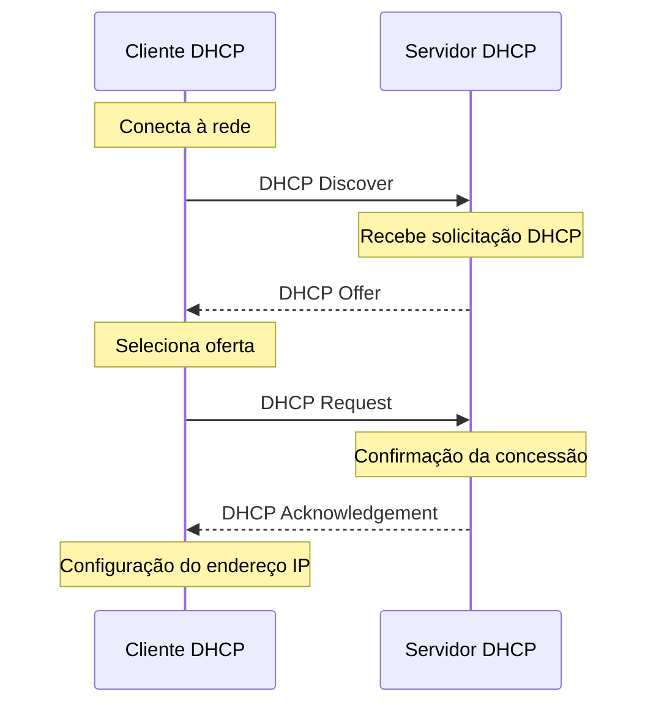
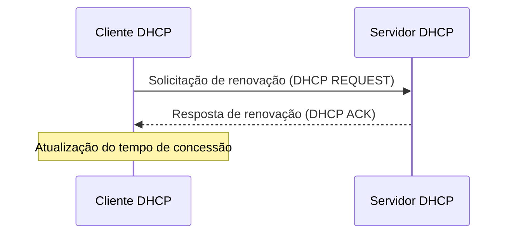

# DHCP

O DHCP (*Dinamic Host Configuration Protocol*) é um protocolo de camada de aplicação, utilizado para atribuição de endereços IP a dispositivos ligados a uma rede de computadores. Utiliza o UDP como protocolo de camada de transporte, com as portas 67 e 68. Utiliza a arquitetura Cliente/Servidor, em que o cliente solicita um endereço IP a um Servidor, este responsável por gerenciar e fornecer os endereços.

Com a utilização do DHCP, os *hosts* podem solicitar a um servidor um IP para que configurem em suas máquinas. Este processo permite que a definição dos IP's seja automática, simplificando o processo de configuração de endereços a dispositivos em uma rede.

Além do endereço IP, outras informações também podem ser obtidas utilizando este protocolo. Dados como máscara de sub-rede, *gateway* padrão e servidores DNS. Utilizando estes dados é possivel que máquina tenha plena funcionalidade a acessos básicos à rede.

O processo de liberação de um endereço IP utilizando o DHCP segue as seguintes etapas:

1. Descoberta `DHCP Discover` (*Discover*):  o cliente DHCP envia uma mensagem de descoberta para encontrar servidores DHCP disponíveis na rede. Essa mensagem é normalmente um pacote de *broadcast* (endereço IP de destino 255.255.255.255) que é enviado em uma rede local. O objetivo é permitir que o cliente encontre um servidor DHCP e solicite um endereço IP.
1. Oferta - `DHCP Offer` (*Offer*): Nesta fase, o servidor DHCP recebe a mensagem de descoberta e respondem com uma oferta de endereço IP disponível. Cada servidor DHCP que recebe a mensagem de descoberta pode responder com uma oferta contendo informações de configuração, como o endereço IP proposto, a máscara de sub-rede, o *gateway* padrão, os servidores DNS e outros parâmetros de rede. O cliente DHCP pode receber várias ofertas de diferentes servidores DHCP.
1. Solicitação `DHCP Request` (*Request*): Após receber as ofertas de diferentes servidores DHCP, o cliente DHCP seleciona uma oferta específica e envia uma solicitação ao servidor escolhido. A solicitação informa qual oferta o cliente aceitou. Isso é feito para evitar conflitos de endereços IP. A solicitação é enviada por *broadcast* para que todos os servidores DHCP saibam que a oferta foi aceita.
1. Concessão `DHCP ACK` (*Acknowledgement*): Nesta última fase, o servidor DHCP que recebeu a solicitação envia uma mensagem de confirmação (conhecida como ACK) ao cliente DHCP. Essa mensagem confirma a atribuição do endereço IP e quaisquer outras informações de configuração. Além disso, também informa ao cliente DHCP o tempo de validade do endereço IP atribuído. O cliente, então, configura seu endereço IP de acordo com as informações recebidas na mensagem de confirmação.

Além dos pacotes `DHCP DISCOVER`, `DHCP OFFER`, `DHCP Request` e `DHCP ACK`, também há outros pacotes, como:

1. Reconhecimento negativo - `DHCP NACK` (*Negative Acknowledgment*): é enviado pelo servidor DHCP quando ele não pode atender à solicitação do cliente DHCP ou quando ocorre um erro na solicitação. Essa negação pode ocorrer se o endereço IP solicitado estiver indisponível ou se houver um conflito de endereço. O `DHCP NAK` notifica o cliente de que sua solicitação foi negada, solicitando que ele reinicie o processo de obtenção de endereço IP.

1. Rejeição - `DHCP DECLINE` (*Decline*): é enviado pelo cliente DHCP para informar ao servidor DHCP que ele rejeita a oferta recebida. Isso pode ocorrer se o cliente já estiver usando o endereço IP oferecido ou se houver algum problema com a oferta recebida, como conflito de endereços. Ao receber o `DHCP DECLINE`, o servidor DHCP pode tentar fazer uma nova oferta ao cliente.

1. Liberação - `DHCP RELEASE` (*Release*): O pacote DHCPRELEASE é enviado pelo cliente DHCP para liberar um endereço IP atribuído anteriormente. Isso geralmente acontece quando o cliente não precisa mais do endereço IP, está saindo da rede ou deseja devolvê-lo ao servidor DHCP para que possa ser atribuído a outro cliente. O DHCPRELEASE permite que o servidor DHCP reutilize o endereço IP liberado.

1. Informação - `DHCP INFORM` (*Information*): é enviado pelo cliente DHCP para obter informações adicionais de configuração, mesmo quando ele já possui um endereço IP válido. Esse pacote é usado pelo cliente para solicitar informações como servidores DNS, servidores de tempo, servidores WINS, etc., sem solicitar um novo endereço IP. O servidor DHCP responde com um pacote DHCPACK contendo as informações solicitadas.

## Renovação do endereço

Periodicamente, a máquina deve solicitar para que o seu endereço IP seja renovado. Este processo de renovação ocorre da seguinte maneira:

1. Solicitação de renovação: Antes do término do tempo de concessão do endereço IP atribuído, o cliente DHCP (geralmente um dispositivo de rede, como um computador ou roteador) envia uma solicitação de renovação ao servidor DHCP que originalmente concedeu o endereço IP. A solicitação de renovação é enviada como um pacote DHCPREQUEST.

1. Resposta do servidor DHCP: O servidor DHCP recebe a solicitação de renovação e verifica se o endereço IP solicitado ainda está disponível. Se o endereço ainda estiver válido, o servidor DHCP responde com um pacote DHCPACK (*ACKnowledgment*), confirmando a renovação do endereço IP.

1. Atualização do tempo de concessão: O cliente DHCP recebe o pacote DHCPACK e atualiza o tempo de concessão do endereço IP. O cliente também atualiza qualquer outra informação relevante recebida no pacote DHCPACK, como a configuração de DNS, *gateway* padrão e outros parâmetros de rede.

:::caution 
É importante ressaltar que, se o servidor DHCP não receber a solicitação de renovação antes do término do tempo de concessão, o endereço IP pode ser considerado não utilizado e pode ser atribuído a outro cliente que esteja solicitando um endereço IP.
:::

Esse processo de renovação de tempo é repetido periodicamente enquanto o dispositivo estiver conectado à rede e precisar manter o endereço IP atribuído a ele. Caso o cliente não possa renovar o endereço IP, ele precisará solicitar um novo endereço IP por meio do processo DHCP de descoberta inicial.

## Referências

**Outros materiais**  
  
[KOZIEROK, C.M. The TCP/IP Guide. *DHCP Renewal and Rebinding Process*.](http://www.tcpipguide.com/free/t_DHCPLeaseRenewalandRebindingProcesses-2.htm)  

 
