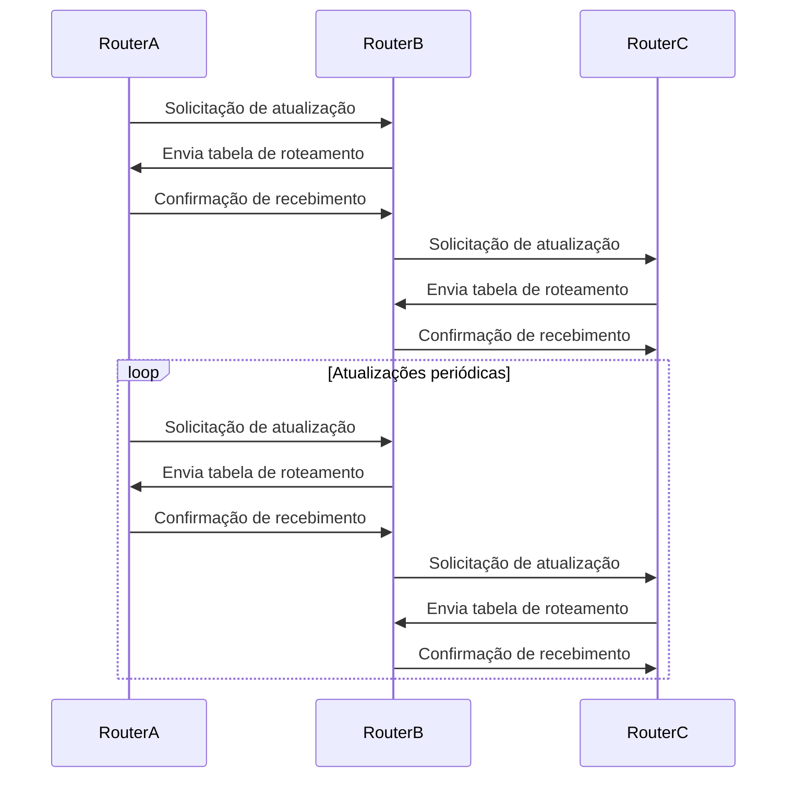

# RIP

O Protocolo de Informação de Roteamento (*Routing Information Protocol* - RIP) é um dos protocolos mais antigos e simples usados em redes de computadores para o roteamento de pacotes. Ele foi desenvolvido para redes pequenas e médias e é um protocolo de vetor de distância.

O RIP opera com base em atualizações periódicas, enviando informações sobre a tabela de roteamento para todos os roteadores na rede. Cada roteador RIP mantém uma tabela de roteamento com informações sobre as redes alcançáveis e a distância métrica para cada uma delas. A métrica padrão do RIP é o número de "saltos" (*hops*) necessários para que se possa alcançar uma rede.

**Exemplo**  

Algumas características-chave do protocolo RIP são:

1. Limite de saltos: O RIP possui um limite máximo de 15 saltos para alcançar uma rede. Isso significa que ele é adequado para redes menores, com topologia simples. Quando um roteador recebe uma atualização de roteamento com uma métrica maior que 15, ele considera a rede inalcançável.

2. Convergência lenta: Devido à natureza do protocolo, o RIP pode ter uma convergência lenta quando há mudanças na topologia da rede. A atualização periódica das tabelas de roteamento pode levar algum tempo para propagar as alterações.

3. Atualizações regulares: O RIP envia atualizações regulares (a cada 30 segundos por padrão) para todos os roteadores na rede, compartilhando informações sobre as redes que conhece. Essas atualizações podem aumentar o tráfego de rede.

4. Algoritmo de vetor de distância: O RIP utiliza o algoritmo de vetor de distância para tomar decisões de roteamento. Ele determina a melhor rota com base na métrica (número de saltos) para alcançar uma rede específica.

5. Autenticação: O RIP pode ser configurado com autenticação simples para garantir que as atualizações de roteamento sejam originárias de roteadores autorizados.

## Desvantagens
<Bib bib='torres_2009_book' page='434'/>

## Versões

Foram elaboradas três versões do protocolo RIP. A versão RIPv1 utiliza as classes de IP. A versão RIPv2 permite o uso de máscaras de rede e autenticação.

Embora o RIP tenha sido amplamente utilizado no passado, sua funcionalidade e eficiência foram superadas por protocolos de roteamento mais avançados, como OSPF (Open Shortest Path First) e BGP (Border Gateway Protocol). No entanto, o RIP ainda pode ser encontrado em redes legadas ou em configurações específicas onde a simplicidade é preferida sobre o desempenho.

### RIPng

A versão do protocolo RIP para IPv5 é conhecida como RIPng (RIP *next generatio* - RIP nova geração). Este protocolo foi desenvolvido com base no RIPv2, porém sem o mecanismo de autenticação, visto que é utilizado o protocolo IPsec.

## Referências

<Bib bib='torres_2009_book' type='abnt'/> 