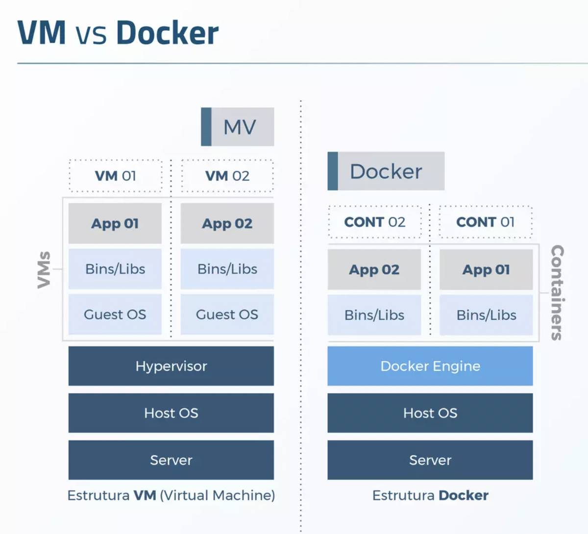

import Tabs from '@theme/Tabs';
import TabItem from '@theme/TabItem';

import Bib from '@site/src/components/Bib';

# Introdução

  
Notação

Abordaremos aqui a nomenclatura do inglês *container* e *containers* (pl.), visto que estes termos são amplamente difundidos desta forma em diversos materiais. Em português, a grafia correspondente é contêiner e contêineres (pl.).

Outra abordagem adotada aqui é a simplificação de virtualização de sistemas operacionais para apenas virtualização.

Chamamos de container ao conceito que envolve as tecnologias e mecanismos de isolamento de processos em um sistema operacional.

O conceito de container é frequentemente associado à tecnologia Docker, embora existam também outras implementações, como containerd e Podman. Os conteiners têm ganhado ampla popularidade na indústria de desenvolvimento de software devido suas caracterísicas isolamento, portabilidade, eficiência e escalabilidade.

## Containers x virtualização de sistemas operacionais

É comum que o uso de containers seja confundido com virtualização de sistemas operacionais. Dizemos que um container atua com isolamento parcial, enquanto que a virtualização opera com isolamento total. Em um container, o *kernel* do sistema operacional é compartilhado com as aplicações executadas, diferente da virtualização.

VM x Docker

Imagem: [JUSTI, A. Slide 13](https://pt.slideshare.net/AndrJusti/apresentao-docker-73035181#13)

### Virtualização

A virtualização é uma técnica que permite a criação de máquinas virtuais (VMs) dentro de um único servidor físico. Cada VM inclui um sistema operacional completo e é isolada do sistema hospedeiro e de outras VMs. Isso é alcançado através do uso de um *hipervisor* (*software* que gerencia e aloca recursos do *hardware* para as VMs). Cada VM pode executar um sistema operacional diferente, permitindo que você tenha várias instâncias de sistemas operacionais independentes em uma única máquina física.

Vantagens:

- Isolamento completo: Cada VM é totalmente isolada das outras, garantindo a segurança e evitando interferências.
- Flexibilidade: É possível executar diferentes sistemas operacionais e configurações em cada VM.
Máquinas Virtuais são independentes do hospedeiro: Você pode mover uma VM entre servidores com diferentes arquiteturas de *hardware* e sistemas operacionais, desde que o *hipervisor* seja compatível.

Desvantagens:

- Sobrecarga: A virtualização consome mais recursos de hardware devido à necessidade de replicar todo o sistema operacional para cada VM.
Inicialização mais lenta: O tempo de inicialização de uma VM é maior, pois é necessário inicializar um sistema operacional completo.

### Containers

Os containers são uma forma de virtualização a nível de sistema operacional. Eles fornecem isolamento para aplicativos e seus ambientes em um único sistema operacional host compartilhado. Os containers compartilham o mesmo kernel do sistema operacional do host, o que os torna mais leves e eficientes do que as VMs.

Cada container inclui apenas as dependências e bibliotecas necessárias para executar o aplicativo, além do aplicativo em si. Eles não contêm um sistema operacional completo, como acontece com as VMs. Isso permite que você execute vários containers em um único sistema host sem o overhead significativo de inicializar múltiplos sistemas operacionais.

Vantagens:

- Eficiência: Containers são mais leves e iniciam mais rapidamente do que máquinas virtuais.
- Portabilidade: Os containers podem ser facilmente movidos entre ambientes, garantindo que o aplicativo se comporte de maneira consistente.
- Escalabilidade: É fácil escalar o número de containers para atender demandas de diferentes níveis.

Desvantagens:

- Menor isolamento: Os containers compartilham o *kernel* do hospedeiro, o que significa que há menos isolamento entre eles do que nas VMs.

## Referências

- [Justi, A. Apresentação Docker. Slideshare.net.](https://pt.slideshare.net/AndrJusti/apresentao-docker-73035181#13)